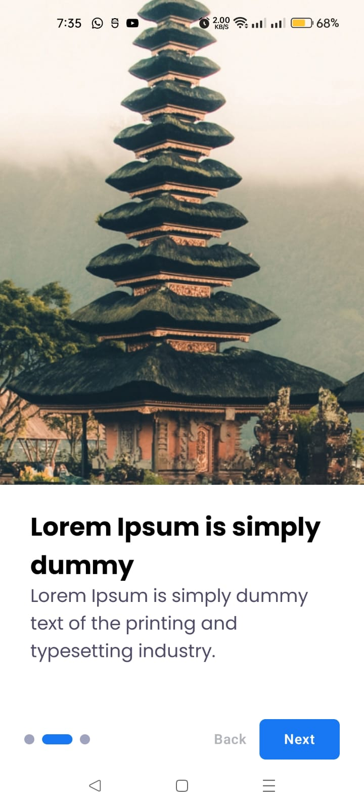
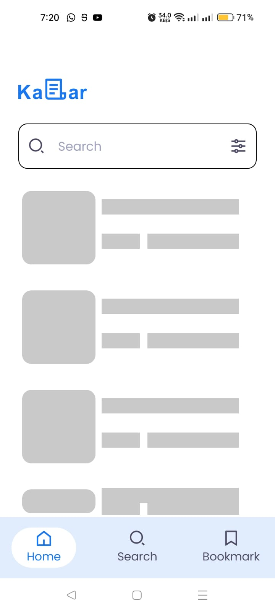
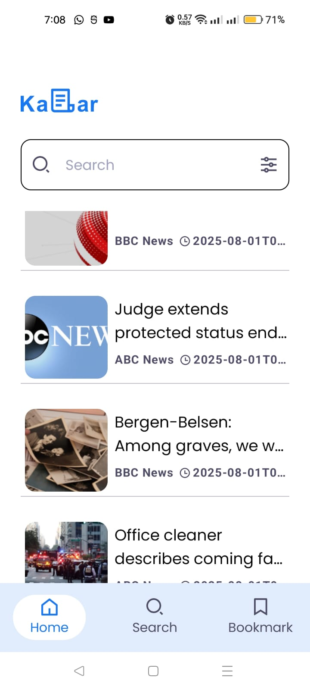
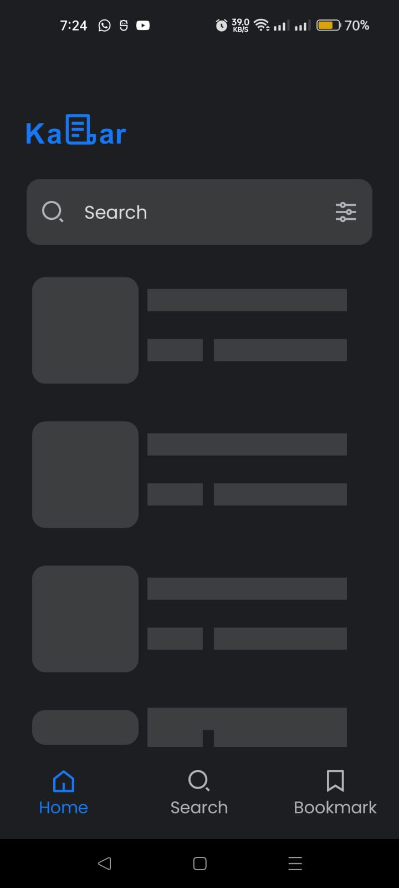
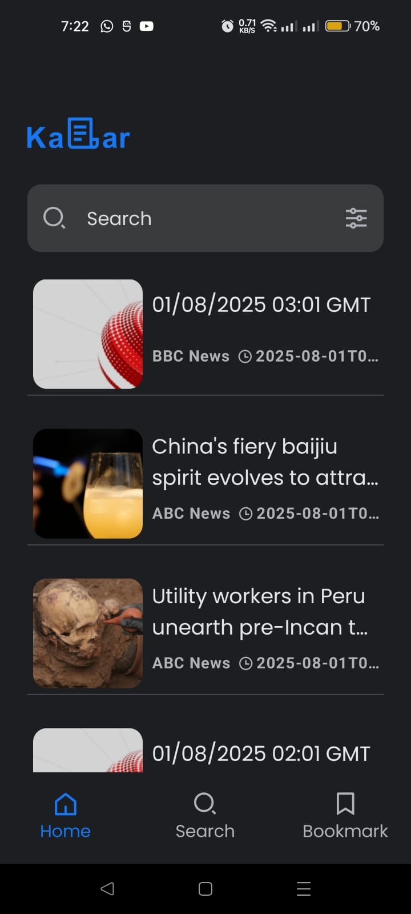

### App screenshots

  
  
  
  
  
  
  
  
  

  
  
  
  
  
  
  
  
  

### Built With:
• Kotlin  
• MVVM Clean Architecture  
• Dependency Injection - Dagger-Hilt  
• Navigation Component  
• ROOM Database  
• Retrofit  
• Paging 3  
• Kotlin Coroutines  
• DataStore  
• Flow   

